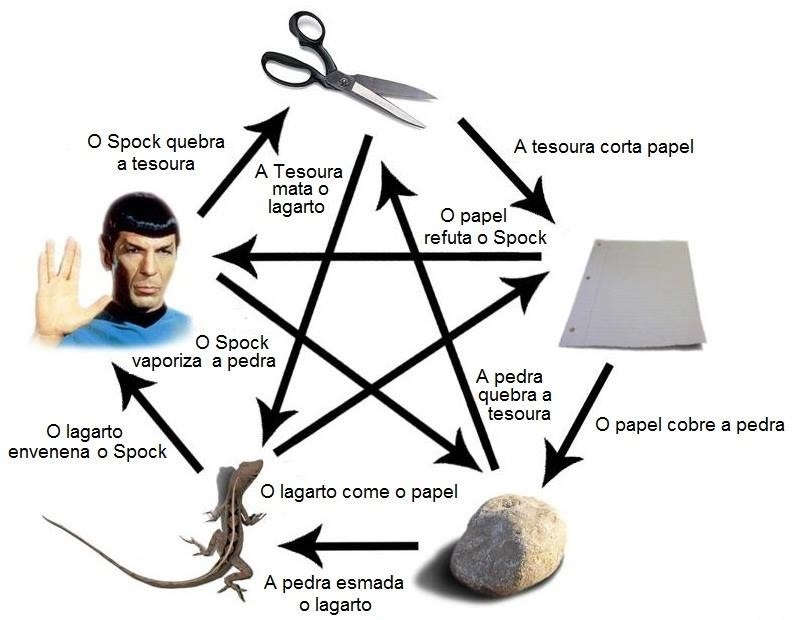

# Jokenpo Lagarto Spock

Foi elaborado o desenvolvimento de uma API onde é possível verificar o vencedor (dentre k jogadores) do jogo Pedra-papel-tesoura-lagarto-Spock (The Big Bang Theory).

O jogo tem como premissa um jokenpo com duas possibilidades adicionais:

  

Para validação do vencedor foi utilizada uma regra simples, considerando em ordem: TESOURA(0), PAPEL(1), PEDRA(2), LAGARTO(3), SPOCK(4).

Onde se nota que todo movimento + 1 e movimento + 3 são vencidos pelo movimento primário, ou seja, a TESOURA (0) vence o PAPEL (0+1) e vence o LAGARTO (0+3).

Após esta constatação bastam duas condições para determinar o vencedor, onde:

- Caso os movimentos sejam iguais o resultado é empate;
- Caso o movimento do adversário seja o próximo ((mov1%5+1)%5) ou seja o terceiro em sequência ((mov1%5+3)%5) você é o vencedor;
- Restando o cenário de derrota que não necessita ser verificado (é possível validá-lo aplicando a mesma regra do passo anterior).

## API Reference

- [Postman Docs](https://documenter.getpostman.com/view/3032535/SzmiWGHV?version=latest)
- [Postman Collection](docs/Jokenpo.postman_collection.json)

## Versioning

We use [SemVer](http://semver.org/) for versioning. For the versions available, see the [tags on this repository](https://github.com/ecjN00B/jokenpoSpock/tags).

## Authors

* **Elias de Carvalho Junior** - [ecjN00B](https://github.com/ecjN00B)

See also the list of [contributors](https://github.com/ecjN00B/jokenpoSpock/contributors) who participated in this project.
